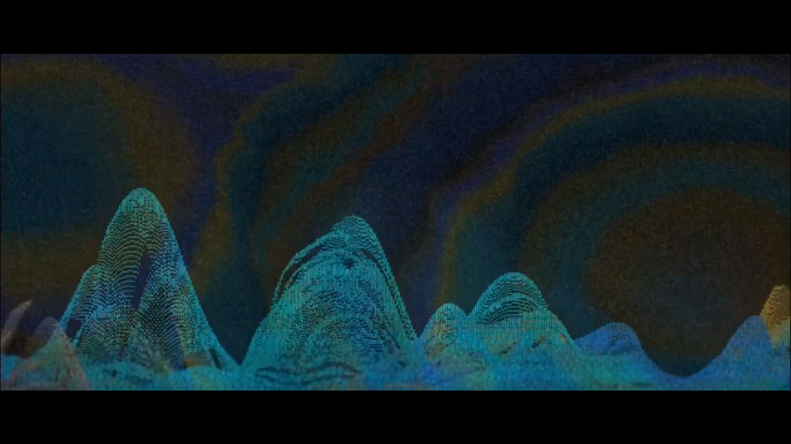
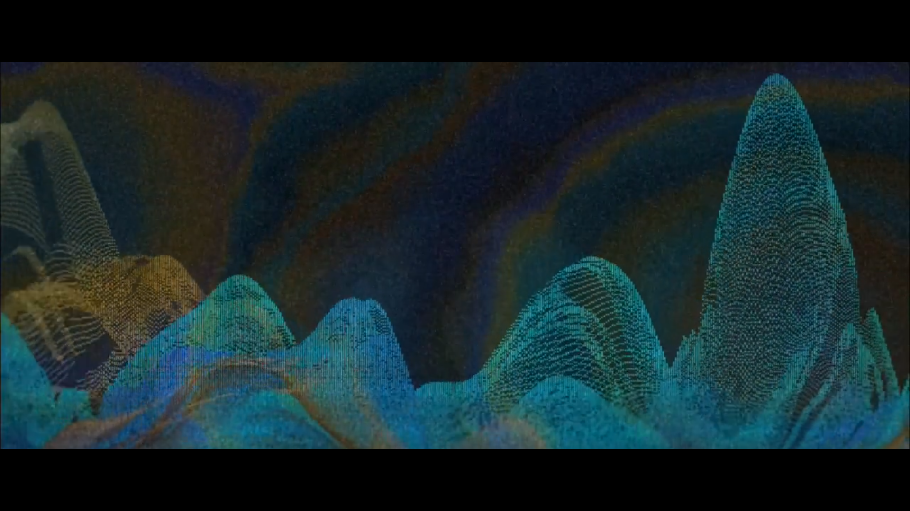
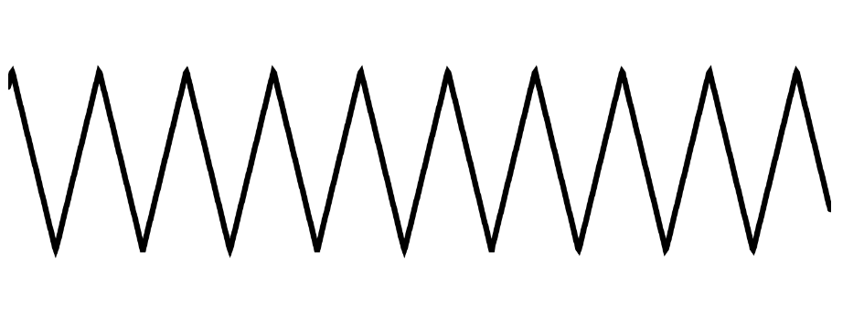
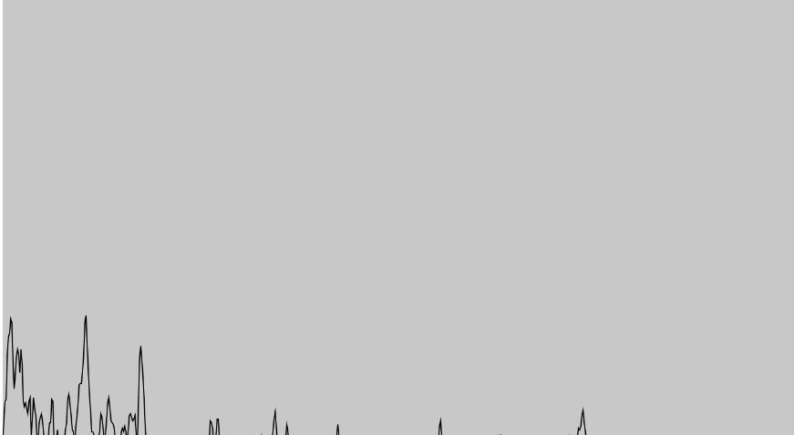
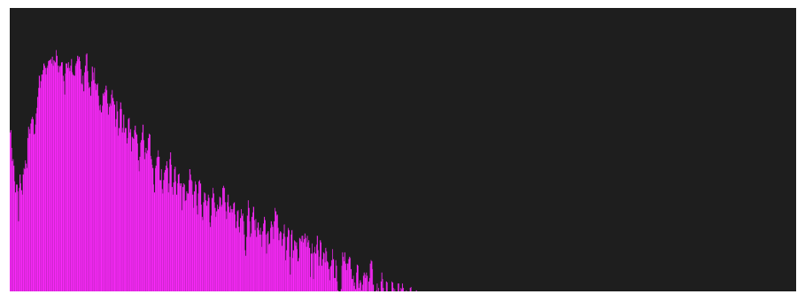
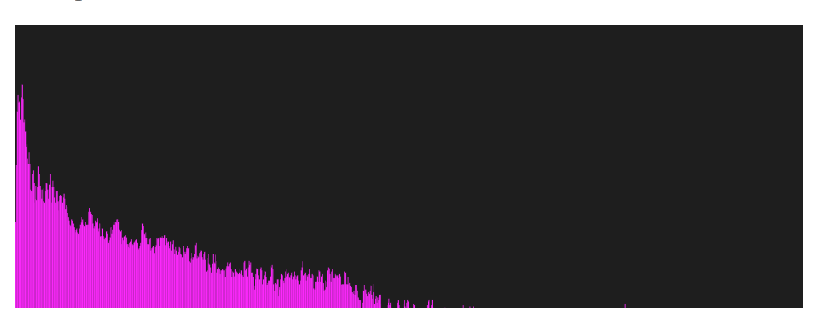

# xzha0656_Quiz_8
## Part1 Imaging Technique Inspiration
### Music Visualization

**Music visualization** is the process of turning sound into a waveform visible on the screen by capturing and analyzing the **spectral characteristics** of the sound. 
In the example below, the artist took inspiration from *traditional Chinese landscape paintings*, extracted *colors* and *landscape features* from the paintings, and transformed a piece of traditional Chinese music into the form of a landscape painting, so that the viewer can visually feel the emotional ups and downs of the music, resulting in a better audio-visual experience.
In a major project we can also use music visualization to make the painting change with the music.

  *TheFamous Chinese Landscape Painting--Thousand Miles of Rivers and Mountains*

*The sample screenshots of the inspiration video*

[Video-Musical visualization combined with Chinese painting style](https://www.xiaohongshu.com/explore/6470db5c0000000013033662?app_platform=android&ignoreEngage=true&app_version=8.33.0&share_from_user_hidden=true&type=video&author_share=1&xhsshare=WeixinSession&shareRedId=N0s1QUc6PEE2NzUyOTgwNjY0OTc2SD85&apptime=1714386410&wechatWid=1b830e44cf4c528d4f2c9d20d7dba433&wechatOrigin=menu)

[Other Musical visualization video with painting style](https://www.bilibili.com/video/BV1454y1477z/?spm_id_from=333.999.0.0&vd_source=77325193929488594248)

[AI+TouchDesigner: Creating a case for tattoo sound visualization](https://www.bilibili.com/video/BV1or421t7T2/?spm_id_from=333.788.recommend_more_video.0&vd_source=8a99cf7769e2ddcda99b9141f7f177f3)

## Part2 Coding Technique Exploration

[Note Envelope](https://p5js.org/zh-Hans/examples/sound-note-envelope.html)

Note envelope can be used to play back the amplitude of the audio by controlling the output and creating a fade-in/fade-out effect.

[Oscillator Frequency](https://p5js.org/zh-Hans/examples/sound-oscillator-frequency.html)
(*Notice: Example sound is a bit harsh, please lower the volume before opening this link!*)
Control an Oscillator and view the waveform using FFT.

[Frequency Spectrum](https://p5js.org/zh-Hans/examples/sound-frequency-spectrum.html)
Visualize the frequency spectrum of live audio input.

[Filter LowPass](https://p5js.org/zh-Hans/examples/sound-filter-lowpass.html)
Apply a p5.LowPass filter to a p5.SoundFile. Visualize the sound with FFT. Map mouseX to the the filter's cutoff frequency and mouseY to resonance/width of the a BandPass filter.

[Wavemaker](https://p5js.org/examples/interaction-wavemaker.html)
WaveMaker can be used with the mouse to control the direction of the waves in the particle oscillations, producing interactive screen effects.
